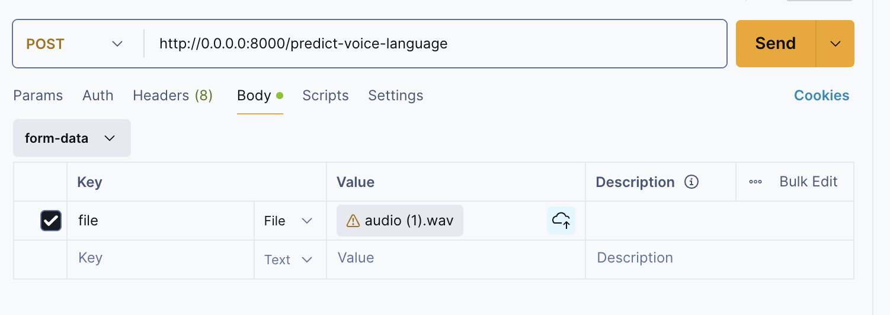

# VOICE LANGUAGE DETECTOR

## Description
A Voice-based language detector from audios, for a python version >= `3.12.x`

The Real Time Recording is a terminal based program, while the API works through Postman.

## Usage

First of all,  create a virtual environment: 

        python -m venv env

and install all the dependencies.

        pip install -r requirements.txt

### Real Time Recording

1. Create a folder named `audios` inside the project root

2. Run the program

        python app.py

### API

1. Run the server

        uvicorn endpoint:app --reload

2. Check if it is running in the route `http://0.0.0.0:8000`

3. Go to Postman and create a `POST` request in this route `http://0.0.0.0:8000/predict-voice-language`

4. In Postman, go to Body and select form-data. You should configure something like this. Then hit the endpoint.

